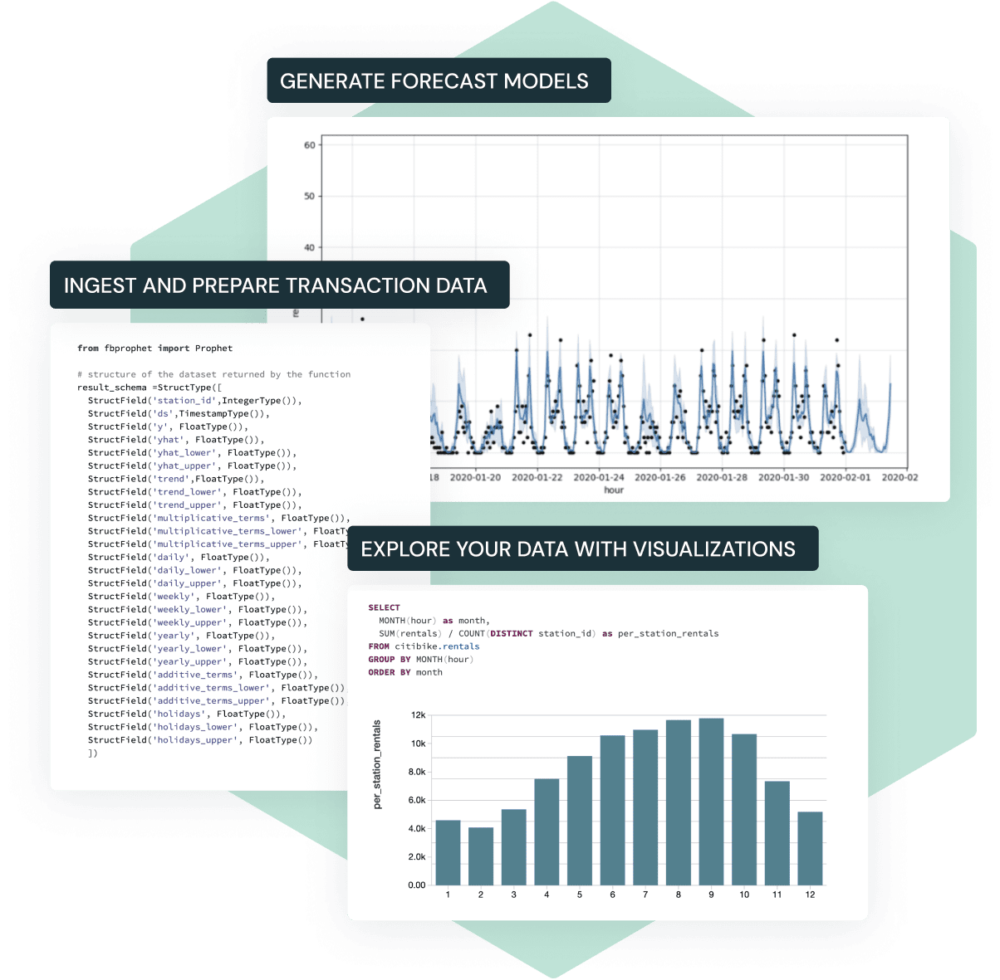

# Demand Forecasting 

Playground of forecasting in R using Prophet. 

Perform fine-grained forecasting in an efficient manner, leveraging the distributed computational power of the Databricks Platform.

*Prophet* is a forecasting tool that uses an additive model where non-linear trends are fit with yearly, weekly, and daily seasonality, plus holiday effects. It works best with time series that have strong seasonal effects and several seasons of historical data. The library is especially suited for business forecasts like forecasting website traffic, sales, and inventory.

>The original paper from the FB team is in the 
[Forecasting_at_Scale.pdf](Forecasting_at_Scale.pdf) file.

## Dataset
For the tests the Store Item Demand Forecasting from Kaggle is used. The data are in the `dataset` directory.

Keggle Dataset: 
https://www.kaggle.com/datasets/aswinkum/demand-forecasting-kernels-only

The dataset contains 5-years of store-item unit sales data for 50 items across 10 different stores (913,000 observations).

## Forecasting in R-Studio
The source file in R for the forecasting is in [Forecasting.R](Forecasting.R).

Read the comments for step-by-step execution of the forecast and plotting.

## Forecasting in DataBricks
The DataBricks notebook for forecasting at scale is in the file [OE_Demand_Forecasting.dbc](OE_Demand_Forecasting.dbc).

A Spark cluster of 8 workers is recommended.

>500 forecasts are generated in the notebook.
